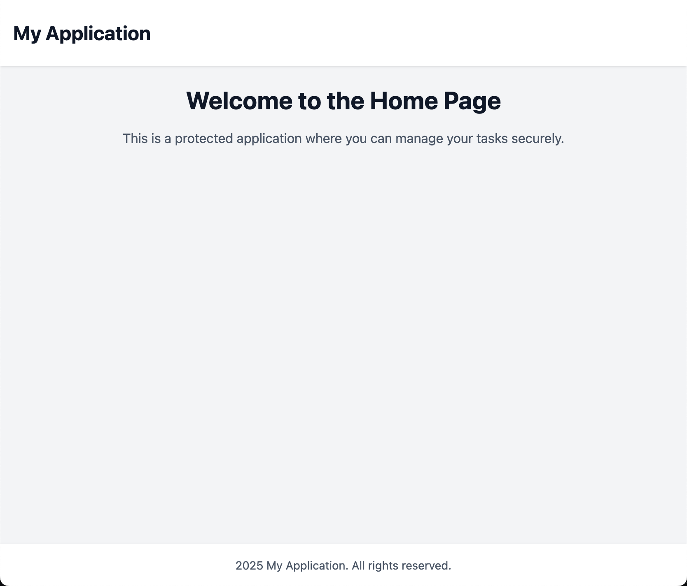

# Electron Browser Shell

此專案為客製化瀏覽器，預設使用自家公司的帳號做身份驗證，掛載自家多項產品時可以直接使用 app 登入後的 token 做免登入。因為是客製化瀏覽器，也可以自己寫邏輯來阻擋特定網址，提高安全性。

## Quick Start(不推薦開發使用)

```bash
$ npm install
$ npm run dev
```

## Development

```bash
$ npm run dev:ui
$ npm run dev:electron
```

## Package App

```bash
$ npm run make
```

打包好的檔案在 `out` 資料夾。

## 環境需求

- Node.js 版本：`>=22.11.0`

<br/><br/>

## Electron Architecture Diagram


### UI

- `browser-operations-panel`：
  
  使用 `react` 建置，為常見的瀏覽器操作面板。

  

- `browser-avatar-menu`：

   使用 `react` 建置，頭像下拉選單，在 electron 中為額外的視窗，所以另外開一個 UI 專案。

  

- `authenticator`：

  使用 `react` 建置，統一由此作登入註冊產品帳號。

  

- `protected-application`：
   
   使用 `react` 建置，假設這是公司產品，且需要登入後才能使用的頁面。

  

<br/>

#### 限制使用 Memory Router

因為網頁內容是跑在 WebContentsView 裡，他不是實際的瀏覽器，並且為了與 `browser-operations-panel` 做 URL 的同步處理，如果使用 BrowserRouter 會產生額外的操作紀錄，增加處理 URL 同步的問題。

<br/>

#### 產品模式下的 URL 為 `app://[ui-app-name]`

electron 是使用 `loadFile` 來載入 UI 專案打把包好的 `index.html`。為了避免暴露檔案的路徑，使用自定義 protocol 處理 `app://` 的來處理 app 自身的頁面。

例如 `app://authenticator/?pathname=/sign-in`：

`app://authenticator`: 表示 ui 的 `authenticator` 專案。

`pathname=/sign-in`: 表示 ui 的 `authenticator` 專案的 router pathname。

<br/>

#### 為何每個 react 專案都有重複的 auth 實作？

因為每個 react 專案可能使用不同的 store manager 來管理 state，這裡僅是為了表示程式碼的靈活度。

<br/><br/>

### Electron Main Process

- `main`：
  
  這是 Electron 的主程式，負責處理 App 的全局環境。

<br/><br/>

### Electron Preload

這裡的 script 是跑在 browser 環境的，而且不能 import 其他模組的程式碼。否則在 runtime 會報錯，只能 import `electron` 和 type。

<br/><br/>

## TODO:

- Tab 使用 drag drop 調整順序。
- 瀏覽器視窗上方調整成跟 chrome 一樣。
- 處理應用程式的 Menu（在 windows 系統，視窗下方會有應用程式的選單）。
- [Validate the sender of all IPC messages](https://www.electronjs.org/docs/latest/tutorial/security#17-validate-the-sender-of-all-ipc-messages)。
- 處理更多瀏覽器快捷鍵。
- package script 在 windows 系統指令使用 `&` 與 UNIX 不同。
